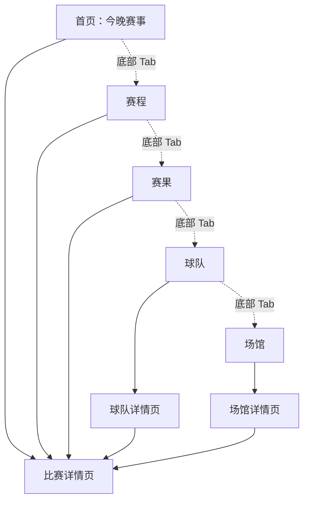

# 2026 男足世界杯观赛指南小程序页面结构与低保真原型

## 1. 页面结构总览



## 2. 底部导航

第一版建议使用 5 个 Tab：

1. 首页
2. 赛程
3. 赛果
4. 球队
5. 场馆

比赛详情、球队详情、场馆详情作为二级页面，不放入底部导航。

## 3. 首页原型

页面目标：用户一打开就知道今晚看什么。

```text
┌────────────────────────┐
│ 世界杯观赛指南          │
│ 2026 男足世界杯         │
├────────────────────────┤
│ 今晚最值得看            │
│ 法国 vs 英格兰          │
│ 03:00｜1/4 决赛｜纽约   │
│ 焦点战 强强对话         │
│ 这场就是今晚主菜...     │
│ [看详情] [去观看]       │
├────────────────────────┤
│ 今晚赛事                │
│ 阿根廷 vs 克罗地亚      │
│ 23:00｜半决赛           │
│ 看点：中场硬碰硬        │
│ 预测：2:1               │
│ [详情]                  │
├────────────────────────┤
│ 首页 赛程 赛果 球队 场馆 │
└────────────────────────┘
```

## 4. 赛程页原型

页面目标：用户可以查看全部比赛，并按日期、阶段、小组、球队筛选。

```text
┌────────────────────────┐
│ 完整赛程                │
├────────────────────────┤
│ [按日期] [按阶段] [小组] │
│ [球队]                  │
├────────────────────────┤
│ 6月12日 周五            │
│ 墨西哥 vs 南非          │
│ 08:00｜小组赛 A组       │
│ 未开始                  │
├────────────────────────┤
│ 6月13日 周六            │
│ 美国 vs 加拿大          │
│ 09:00｜小组赛 B组       │
│ 未开始                  │
└────────────────────────┘
```

## 5. 赛果页原型

页面目标：用户快速回顾昨天比赛。

```text
┌────────────────────────┐
│ 昨日赛果                │
├────────────────────────┤
│ 巴西 3 - 1 日本         │
│ 最佳球员：维尼修斯      │
│ 一句话总结：下半场开大  │
│ [集锦] [看战报]         │
├────────────────────────┤
│ 德国 1 - 1 乌拉圭       │
│ 点球大战：德国 4 - 3    │
│ 关键事件：第88分钟绝平  │
│ [集锦] [看战报]         │
└────────────────────────┘
```

## 6. 球队页原型

页面目标：用户快速了解参赛球队。

```text
┌────────────────────────┐
│ 球队资料                │
├────────────────────────┤
│ 搜索球队                │
├────────────────────────┤
│ A组                     │
│ 阿根廷｜夺冠热门｜★★★★★ │
│ 法国｜锋线豪华｜★★★★★   │
│ 日本｜亚洲强队｜★★★☆     │
└────────────────────────┘
```

## 7. 场馆页原型

页面目标：用户查看所有比赛场馆。

```text
┌────────────────────────┐
│ 比赛场馆                │
├────────────────────────┤
│ 大都会人寿体育场        │
│ 美国｜纽约/新泽西       │
│ 容量：82500             │
│ 承办：8 场比赛          │
│ [查看场馆]              │
└────────────────────────┘
```

## 8. 可点击 HTML 原型

已提供一个可点击低保真原型：

[prototype.html](/Users/maozhan/Documents/VB-世界杯观赛指南/prototype.html)

可以直接用浏览器打开查看。该原型主要用于确认页面结构、信息优先级和跳转关系，不代表最终视觉设计。

